# Analysis of Song Genres

This project is based on SparkSQL for analysis of different music genres, artists, albums and songs. In the final part of the project, we use matplotlib library for visualization purpose. 

Two datasets are used:

1. listenings.csv 
   https://drive.google.com/file/d/14dMLzOTIf1GK-P6bA9rVEI_1WSedOdZU/view?usp=sharing
   - A data file of 1GB
   - Contains: user_id, date, track, artist and album
2. genre.csv
   https://drive.google.com/file/d/1q8VWIZFjlOP_91z0GjbCe4RpmtGVDkvz/view?usp=sharing
   - Contains: artist, genre 

## Analysis Performed

1. 'Date' column is removed from the dataset and rows with na are dropped.

2. Find all of the records of those users who have listened to Rihanna

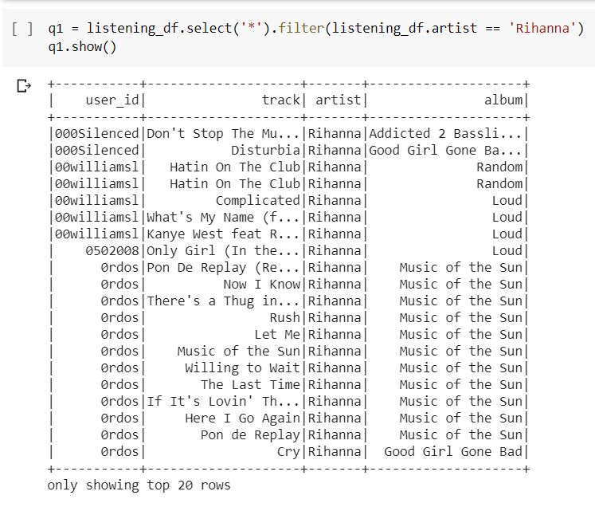

3. Find top 10 users who are fan of Rihanna

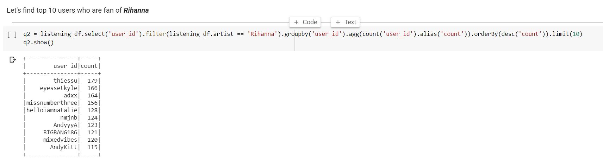

4. Find top 10 famous tracks

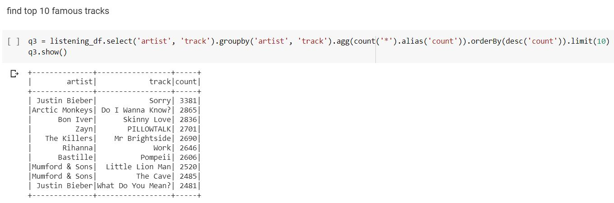

5. Find top 10 famous tracks of Rihanna

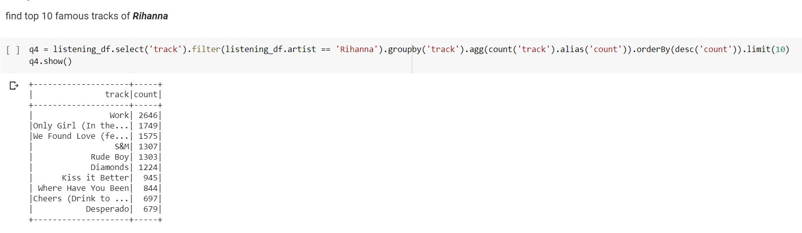

6. Find top 10 famous albums

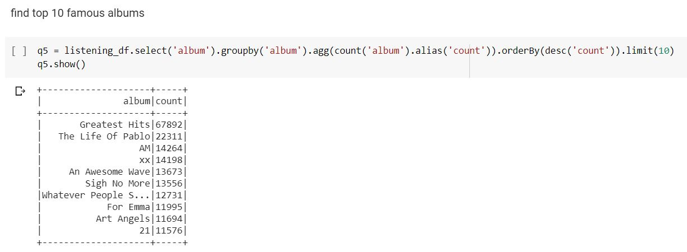

7. Inner join two dataframes

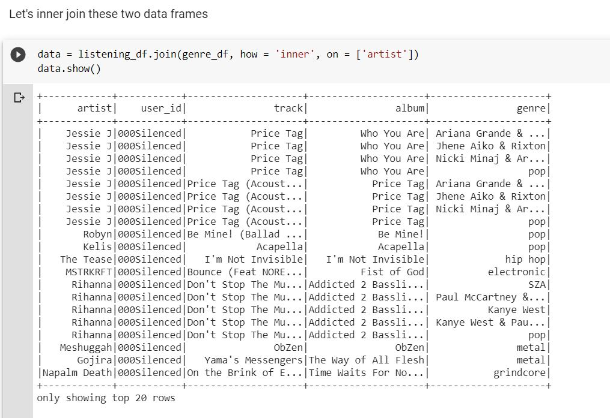

8. Find top 10 users who are fan of pop music

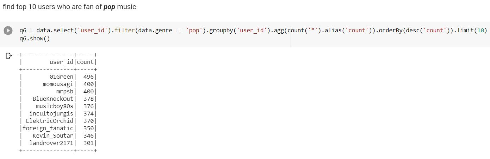

9. Find top 10 famous genres

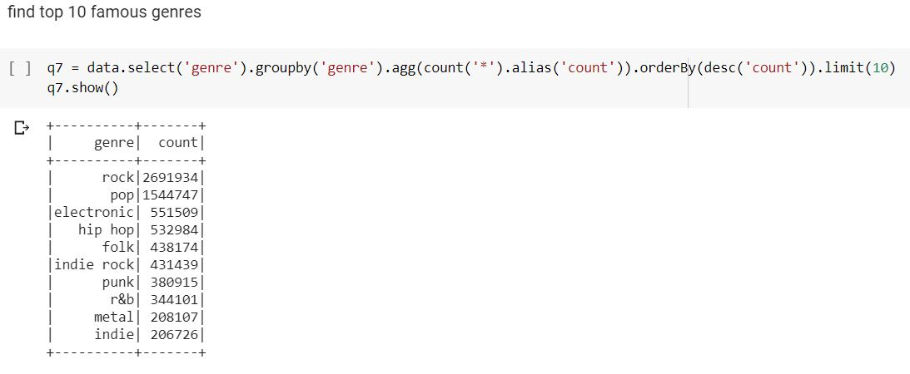

10. Find out each user favourite genre

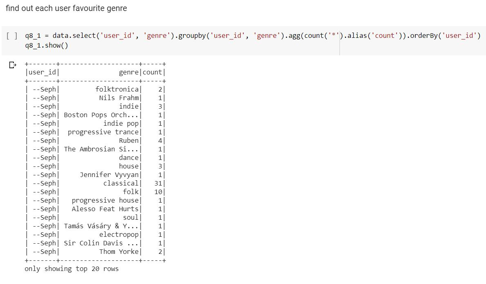

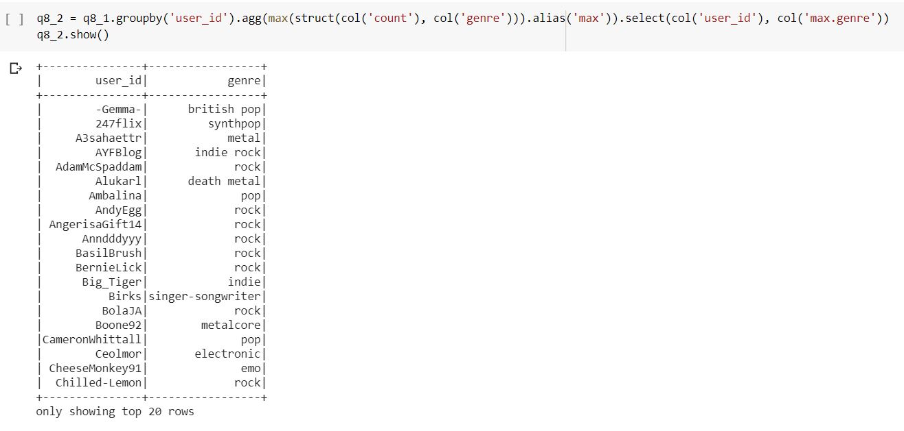

11. find out how many pop,rock,metal and hip hop singers we have and then visualize it using bar chart

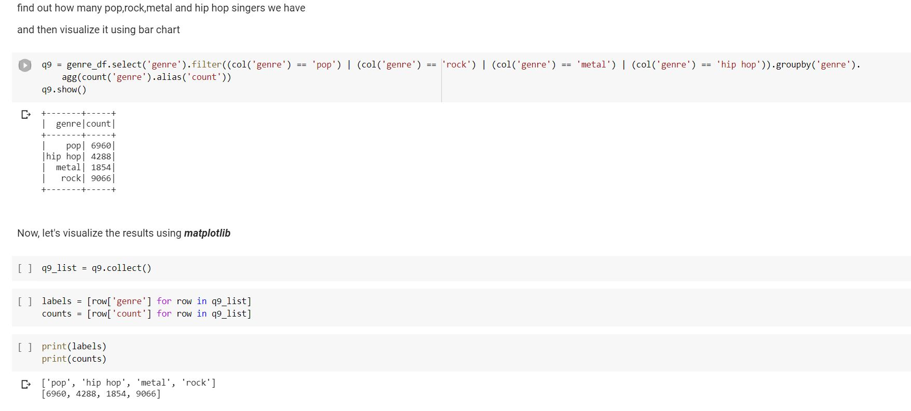

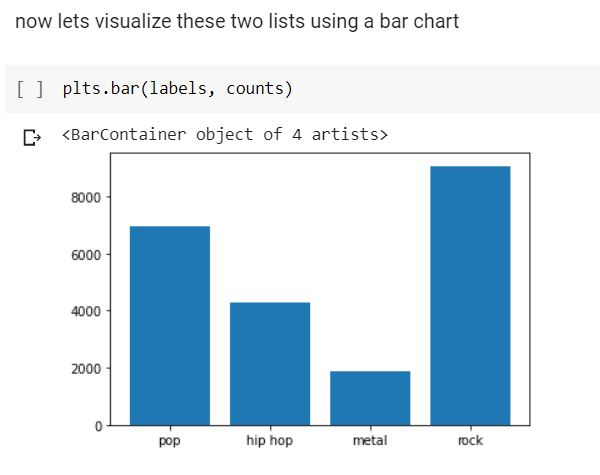

